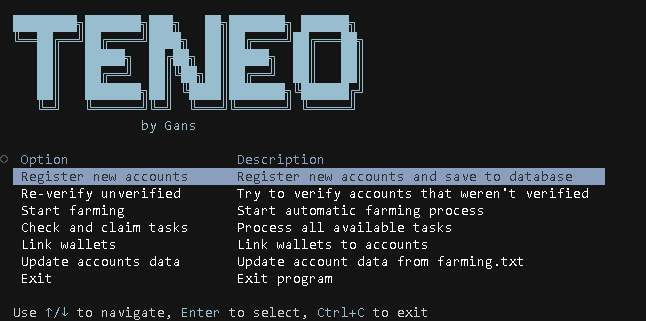

# Teneo Farm 🚀


> **Note:** This is paid software. 
> You can ask me to provide a license for 1 day for testing. 
> To purchase, contact via Telegram: [@gaansss](https://t.me/gaansss)

Teneo Farm is an automation tool for managing account registration and farming on the Teneo platform.



## Features ✨

- 🔐 Secure account authentication
- 👤 Automated account registration with referral code support
- 💼 ETH wallet linking to accounts
- 🤖 Account farming via WebSocket connections
- 📊 Statistics tracking and data updates
- 🔄 Multi-threaded processing
- 🌐 Proxy support with rotation on errors
- 📝 Comprehensive logging system

## Requirements 📋

- Python 3.11+ 🐍
- PostgreSQL database
- Windows or Linux operating system

## Installation 🔧

1. Download the executable file for your platform
2. Edit configuration file `settings.yaml` (see example below)

## Configuration ⚙️

Main settings in the `settings.yaml` file:

```yaml
# Database configuration
database:
  host: your_database_host
  port: 5432
  name: your_database_name
  user: your_database_user
  password: your_database_password

# Farming configuration
farming:
  batch_size: 100  # number of accounts in one batch
  batch_delay: 5  # delay between batches in seconds
  account_delay: 1  # delay between accounts in batch in seconds
  ping_interval: 10  # ping sending interval in seconds
  worker_processes: 4  # number of processes for message processing
  start_threads: 5  # number of initial threads for farming startup

# Registration configuration
registration:
  threads: 3
  delay: 10  # seconds between registrations
```

### Data Files Format

1. `data/accounts.txt` - list of accounts for registration:
   ```
   email:password
   email:password
   ```

2. `data/farming.txt` - list of accounts for farming:
   ```
   email:password
   email:password
   ```

3. `data/proxies.txt` - list of proxies (one per line):
   ```
   username:password@host:port
   username:password@host:port
   ```

4. `data/wallets.txt` - list of ETH wallets:
   ```
   private_key
   private_key
   ```

5. `data/reff_codes.txt` - list of referral codes:
   ```
   code
   code
   ```

## License System 🔑

The application uses a license system to authenticate users:

1. When you run the application for the first time, you will be prompted to enter your license key
2. The license key will be verified with the license server
3. After successful verification, your license key will be saved in the `config.json` file

If you don't have a license key, please contact the developer.

## Usage 🖥️

### Running the Executable

#### Windows:
1. Run `teneo_farm.exe` by double-clicking it or from command line:
   ```
   teneo_farm.exe
   ```

#### Linux:
1. Make sure the file has execution permissions:
   ```bash
   chmod +x teneo_farm
   ```
2. Run the program:
   ```bash
   ./teneo_farm
   ```

## Main Operations 📝

- **Register new accounts** - Register new accounts on the Teneo platform
- **Re-verify unverified** - Try to verify accounts that weren't verified
- **Start farming** - Start automatic farming process
- **Check and claim tasks** - Process all available tasks
- **Link wallets** - Link ETH wallets to accounts
- **Update accounts data** - Update account data from farming.txt

### Email Requirements ⚠️

For account registration, you need access to the email accounts for verification. The application supports different IMAP modes:

- **Single IMAP Mode**: One IMAP server to all domain
- **Multi IMAP Mode**: Each account type (gmail, outlook, etc.) has its own IMAP settings
- **Forwarding Mode**: All verification emails are forwarded to a single account

Configure the IMAP settings in `settings.yaml` under the `email` section.

### Proxy Support 🌐

The application supports using proxies to avoid IP-based rate limiting. Configure proxy settings in `settings.yaml`:

- Enable/disable proxy usage
- Automatic proxy rotation on connection errors

Add your proxies to `data/proxies.txt` in the format:
```
username:password@host:port
```

## Database Integration 🗄️

The application uses PostgreSQL database to store:
- Account information
- Farming statistics
- Referral codes

Configure database connection in `settings.yaml` under the `database` section.

### Free Neon Database Option

You can use a free [Neon](https://neon.tech) PostgreSQL database for this application:

1. Create a free account at [neon.tech](https://neon.tech)
2. Create a new project
3. Get your connection details from the dashboard
4. Update your `settings.yaml` with these credentials:
   ```yaml
   database:
     host: your-neon-hostname.neon.tech
     port: 5432
     name: your_database_name
     user: your_username
     password: your_password
     ssl_mode: require
   ```

Neon provides a generous free tier with:
- Unlimited PostgreSQL databases
- 3 GiB of storage
- Auto-scaling compute
- No credit card required

## Troubleshooting 🔍

- If you encounter any issues with the license verification, check your internet connection
- Ensure the `settings.yaml` file is properly configured
- Check the logs in the `logs` directory for detailed error information
- For database connection issues, verify your PostgreSQL credentials and network configuration

## Support 📞

For support, please contact the developer via Telegram: [@gaansss](https://t.me/gaansss) 
